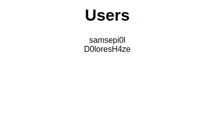

# Lipscomb ABET Data Website
Website for Lipscomb ABET Data Collection

## Installation
A quick guide on installation to start working on the site.

1. First cd to where you want the project repository to live then `git clone https://github.com/tyrvi/cctABET.git`. Of course you need to make sure you have git installed.
2. Next you need to make sure you have node.js installed. You can find a link to the 
[LTS version here](https://nodejs.org/en/download/). The LTS version we are using is v8.9.4. When you
install node you will also get npm.
3. You need to install create-react-app globally. So now that you have npm you should be able to type `npm install -g create-react-app`. Make sure that create-react-app is installed with `create-react-app --version`
4. Next go to the directory of the react app in the project `cd cctABET/src/site`.
5. Once in the correct directory run npm install. This should install all the dependencies of the application.
6. Next go to the server folder located at `cctABET/src/server`.
7. Here we also need to run `npm install`.
8. Once that has installed you can start the server. If you want to start in DEBUG mode use `DEBUG=server:* PORT=3001 npm start` otherwise use `PORT=3001 npm start`. This will start a local version of the server running on port 3001. The reason we use port 3001 here is because the default for the react app is port 3000. Really what matters is that you don't start the server and the react app on the same port.
9. Open a new terminal and go to the site directory `cd cctABET/src/site` and run `npm start`. This will start the react application. A page should open in your browser showing something like 

10. Now you should be able to make changes to the server code or react code and just hit refresh to see the changes. 

Let me know if you are able to get it working. If you have any issues post a message in the slack general channel.
